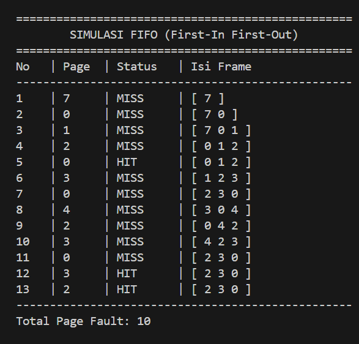

# Laporan Praktikum Minggu [10]
Topik: Manajemen Memori – Page Replacement (FIFO & LRU)

---

## Identitas
- **Nama**  : [Fatkhurrohman Gilang Ramadhan]  
- **NIM**   : [250202985]  
- **Kelas** : [1 IKRB]

---

## Tujuan
Setelah menyelesaikan tugas ini, mahasiswa mampu:
1. Mengimplementasikan algoritma page replacement FIFO dalam program.
2. Mengimplementasikan algoritma page replacement LRU dalam program.
3. Menjalankan simulasi page replacement dengan dataset tertentu.
4. Membandingkan performa FIFO dan LRU berdasarkan jumlah *page fault*.
5. Menyajikan hasil simulasi dalam laporan yang sistematis.

---

## Dasar Teori
1. Memori Virtual & Page Replacement: Ketika memori fisik penuh dan halaman baru perlu dimuat, OS harus memilih halaman mana yang akan dikeluarkan. Proses ini disebut page replacement.

2. Page Fault: Kondisi saat program mencoba mengakses halaman yang tidak ada di memori fisik (RAM), sehingga OS harus mengambilnya dari penyimpanan sekunder.

3. Algoritma FIFO (First-In First-Out): Algoritma yang mengganti halaman yang pertama kali masuk ke memori tanpa memperhatikan seberapa sering halaman tersebut diakses.

4. Algoritma LRU (Least Recently Used): Algoritma yang mengganti halaman yang sudah paling lama tidak digunakan, berdasarkan prinsip lokalitas referensi.

5. Belady’s Anomaly: Fenomena pada FIFO di mana penambahan jumlah frame justru dapat meningkatkan jumlah page fault.
---

## Langkah Praktikum
1. **Menyiapkan Dataset**

   Gunakan *reference string* berikut sebagai contoh:
   ```
   7, 0, 1, 2, 0, 3, 0, 4, 2, 3, 0, 3, 2
   ```
   Jumlah frame memori: **3 frame**.

2. **Implementasi FIFO**

   - Simulasikan penggantian halaman menggunakan algoritma FIFO.
   - Catat setiap *page hit* dan *page fault*.
   - Hitung total *page fault*.

3. **Implementasi LRU**

   - Simulasikan penggantian halaman menggunakan algoritma LRU.
   - Catat setiap *page hit* dan *page fault*.
   - Hitung total *page fault*.

4. **Eksekusi & Validasi**

   - Jalankan program untuk FIFO dan LRU.
   - Pastikan hasil simulasi logis dan konsisten.
   - Simpan screenshot hasil eksekusi.

5. **Analisis Perbandingan**

   Buat tabel perbandingan seperti berikut:

   | Algoritma | Jumlah Page Fault | Keterangan |
   |:--|:--:|:--|
   | FIFO | ... | ... |
   | LRU | ... | ... |


   - Jelaskan mengapa jumlah *page fault* bisa berbeda.
   - Analisis algoritma mana yang lebih efisien dan alasannya.

6. **Commit & Push**

   ```bash
   git add .
   git commit -m "Minggu 10 - Page Replacement FIFO & LRU"
   git push origin main
   ```

---

## Kode / Perintah
Tuliskan potongan kode atau perintah utama:
```bash
def print_table(title, reference_string, history, faults):
    print(f"\n{'='*50}")
    print(f"{title.center(50)}")
    print(f"{'='*50}")
    print(f"{'No':<4} | {'Page':<5} | {'Status':<8} | {'Isi Frame':<15}")
    print("-" * 50)
    
    for i, (page, status, frame) in enumerate(history):
        frame_str = str(frame).replace('[', '[ ').replace(']', ' ]').replace(',', '')
        print(f"{i+1:<4} | {page:<5} | {status:<8} | {frame_str:<15}")
    
    print("-" * 50)
    print(f"Total Page Fault: {faults}")

def simulate():
    pages = [7, 0, 1, 2, 0, 3, 0, 4, 2, 3, 0, 3, 2]
    capacity = 3
    
    # --- SIMULASI FIFO ---
    fifo_memory = []
    fifo_history = []
    fifo_faults = 0
    
    for page in pages:
        if page not in fifo_memory:
            status = "MISS"
            if len(fifo_memory) < capacity:
                fifo_memory.append(page)
            else:
                fifo_memory.pop(0)
                fifo_memory.append(page)
            fifo_faults += 1
        else:
            status = "HIT"
        fifo_history.append((page, status, list(fifo_memory)))
    
    print_table("SIMULASI FIFO (First-In First-Out)", pages, fifo_history, fifo_faults)

    # --- SIMULASI LRU ---
    lru_memory = []
    lru_history = []
    lru_faults = 0
    
    for page in pages:
        if page not in lru_memory:
            status = "MISS"
            if len(lru_memory) < capacity:
                lru_memory.append(page)
            else:
                lru_memory.pop(0)
                lru_memory.append(page)
            lru_faults += 1
        else:
            status = "HIT"
            # Move to end (most recently used)
            lru_memory.remove(page)
            lru_memory.append(page)
        lru_history.append((page, status, list(lru_memory)))

    print_table("SIMULASI LRU (Least Recently Used)", pages, lru_history, lru_faults)

if __name__ == "__main__":
    simulate()
```

---

## Hasil Eksekusi
Sertakan screenshot hasil percobaan atau diagram:

.png)
---

## Analisis
   | Algoritma | Jumlah Page Fault | Keterangan |
   |:--|:--:|:--|
   | FIFO | 10 | Mengganti halaman yang pertama kali masuk (tertua) tanpa melihat riwayat akses. |
   | LRU | 9 | Mengganti halaman yang paling lama tidak digunakan; lebih efisien pada dataset ini. |
1. Jelaskan mengapa jumlah page fault bisa berbeda.
   * FIFO: Menghasilkan jumlah page fault yang biasanya lebih banyak karena tidak mempertimbangkan pola akses.
   * LRU: Lebih efisien karena memanfaatkan prinsip lokalitas; halaman yang baru saja dipakai tidak akan dihapus karena kemungkinan besar akan dipakai lagi.
2. Analisis algoritma mana yang lebih efisien dan alasannya.
   * Lokalitas Temporal: LRU mengasumsikan halaman yang baru saja diakses akan segera dibutuhkan lagi. Dengan memindahkan halaman HIT ke posisi terbaru, data penting tetap bertahan di RAM.

   * Kecerdasan Seleksi: Tidak seperti FIFO yang "buta" terhadap frekuensi akses, LRU hanya membuang halaman yang sudah "berdebu" atau tidak aktif, sehingga meminimalkan operasi I/O ke disk yang lambat.

   * Stabilitas: LRU adalah stack algorithm yang bebas dari Belady’s Anomaly, menjamin performa yang lebih stabil seiring bertambahnya jumlah frame.
---

## Kesimpulan
1. FIFO adalah algoritma yang paling sederhana untuk diimplementasikan namun berisiko mengalami Belady's Anomaly, di mana penambahan frame justru dapat meningkatkan page fault.

2. LRU memberikan pendekatan yang lebih cerdas dengan memprediksi kebutuhan masa depan berdasarkan penggunaan terakhir, sehingga umumnya menghasilkan performa sistem yang lebih stabil.

---

## Quiz
1. [Apa perbedaan utama FIFO dan LRU?]  
   **Jawaban: FIFO mengganti halaman yang pertama kali masuk ke memori tanpa melihat aktivitasnya, sedangkan LRU mengganti halaman yang sudah paling lama tidak digunakan/diakses oleh sistem.**  
2. [Mengapa FIFO dapat menghasilkan Belady’s Anomaly?]  
   **Jawaban: Karena FIFO tidak mempertimbangkan pola akses halaman. Halaman yang sering dibutuhkan bisa saja dikeluarkan hanya karena ia masuk lebih awal, sehingga penambahan slot memori tidak selalu menjamin penurunan page fault.**  
3. [Mengapa LRU umumnya menghasilkan performa lebih baik dibanding FIFO?]  
   **Jawaban: Karena LRU bekerja berdasarkan prinsip lokalitas, yaitu berasumsi bahwa halaman yang baru saja digunakan kemungkinan besar akan digunakan kembali, sehingga meminimalkan pemuatan ulang dari disk.**  

---

## Refleksi Diri
Tuliskan secara singkat:
- Apa bagian yang paling menantang minggu ini?  
- Bagaimana cara Anda mengatasinya?  

---

**Credit:**  
_Template laporan praktikum Sistem Operasi (SO-202501) – Universitas Putra Bangsa_
