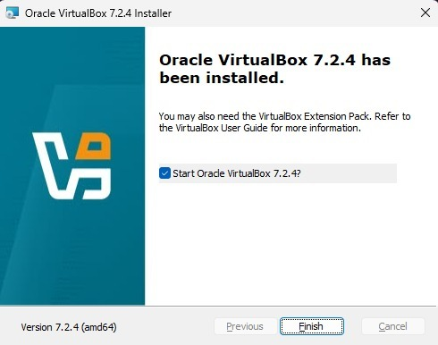
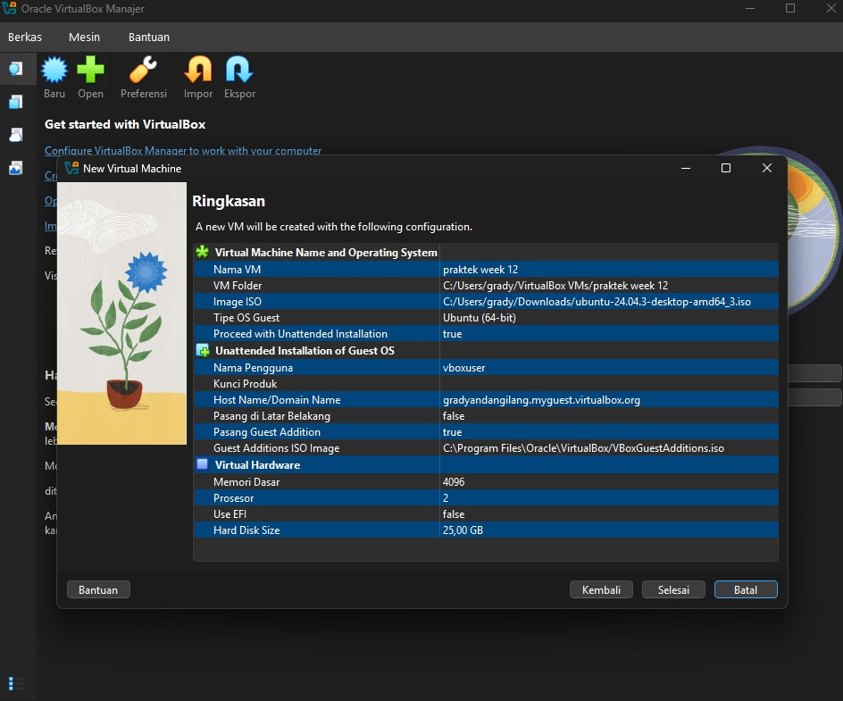
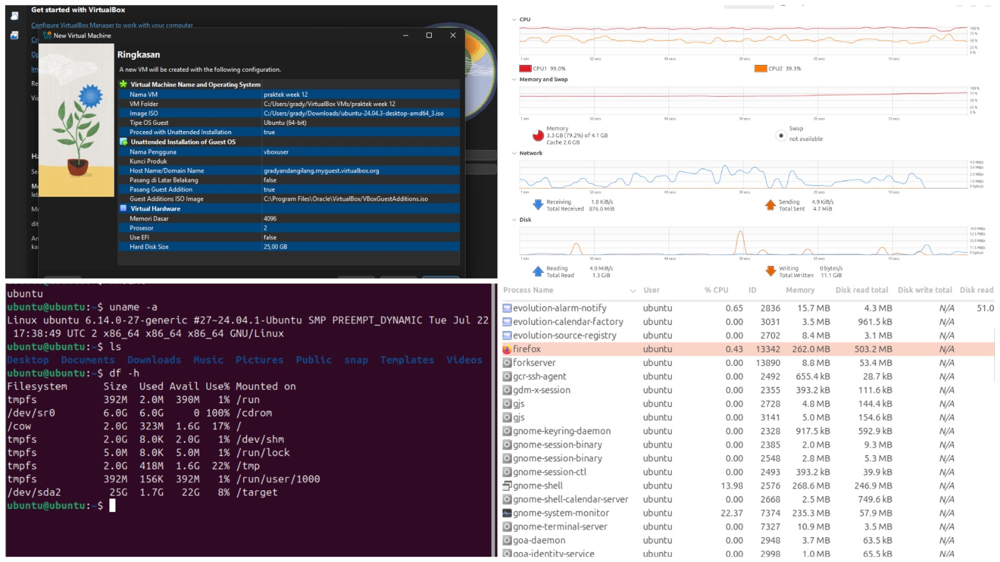
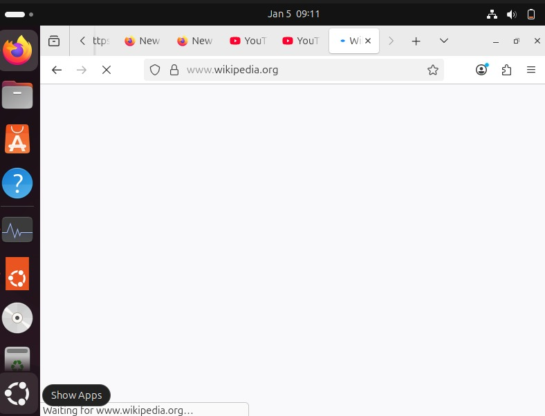

# Laporan Praktikum Minggu 12
Topik: Virtualisasi Menggunakan Virtual Machine

---

## Identitas
- **Nama dan NIM**  : 
- Gradyan Alannahda Shofari (250202940) 
- Fathkurrohman Gilang Ramadhan (250202985)
- **Kelas** : 1IKRB

---

## Tujuan
1. Menginstal perangkat lunak virtualisasi (VirtualBox/VMware).  
2. Membuat dan menjalankan sistem operasi guest di dalam VM.  
3. Mengatur konfigurasi resource VM (CPU, RAM, storage).  
4. Menjelaskan mekanisme proteksi OS melalui virtualisasi.  
5. Menyusun laporan praktikum instalasi dan konfigurasi VM secara sistematis.

---

## Dasar Teori
1. Konsep Virtualisasi Virtualisasi adalah teknologi yang memungkinkan pembuatan versi virtual dari sumber daya komputasi, seperti sistem operasi, server, perangkat penyimpanan, atau jaringan. Ini memungkinkan satu komputer fisik (host) menjalankan beberapa sistem operasi (guest) secara bersamaan.

2. Hypervisor Hypervisor (atau Virtual Machine Monitor/VMM) adalah perangkat lunak yang membuat dan menjalankan VM.
   * Type 1 (Bare Metal): Berjalan langsung di atas hardware (contoh: VMware ESXi, Microsoft Hyper-V).
   * Type 2 (Hosted): Berjalan di atas sistem operasi host (contoh: Oracle VirtualBox, VMware Workstation). Pada praktikum ini, kita menggunakan Type 2.

3. Host OS vs Guest OS
   * Host OS: Sistem operasi fisik yang menjalankan perangkat lunak virtualisasi.
   * Guest OS: Sistem operasi yang berjalan di dalam container virtual (VM).

---

## Langkah Praktikum
1. **Instalasi Virtual Machine**
   - Instal VirtualBox atau VMware pada komputer host.  
   - Pastikan fitur virtualisasi (VT-x / AMD-V) aktif di BIOS.

2. **Pembuatan OS Guest**
   - Buat VM baru dan pilih OS guest (misal: Ubuntu Linux).  
   - Atur resource awal:
     - CPU: 1–2 core  
     - RAM: 2–4 GB  
     - Storage: ≥ 20 GB

3. **Instalasi Sistem Operasi**
   - Jalankan proses instalasi OS guest sampai selesai.  
   - Pastikan OS guest dapat login dan berjalan normal.

4. **Konfigurasi Resource**
   - Ubah konfigurasi CPU dan RAM.  
   - Amati perbedaan performa sebelum dan sesudah perubahan resource.

5. **Analisis Proteksi OS**
   - Jelaskan bagaimana VM menyediakan isolasi antara host dan guest.  
   - Kaitkan dengan konsep *sandboxing* dan *hardening* OS.

6. **Dokumentasi**
   - Ambil screenshot setiap tahap penting.  
   - Simpan di folder `screenshots/`.

7. **Commit & Push**
   ```bash
   git add .
   git commit -m "Minggu 12 - Virtual Machine"
   git push origin main
   ```


---

## Kode / Perintah
Tuliskan potongan kode atau perintah utama:
```bash
# Mengecek user yang sedang aktif
whoami

# Menampilkan informasi detail kernel dan arsitektur sistem
uname -a

# Menampilkan daftar file di direktori saat ini
ls

# Mengecek penggunaan Memori (RAM) 
free -h
```

---

## Hasil Eksekusi
Sertakan screenshot hasil percobaan atau diagram:
1. Persiapan dan Instalasi
Proses menginstal Oracle Virtual Box untuk persiapan dalam pembuatan Virtual Machine.

2. Konfigurasi & Instalasi VM
Proses pembuatan mesin virtual menggunakan fitur Unattended Install di VirtualBox untuk otomatisasi instalasi Ubuntu.

3. Eksperimen VM linux Ubuntu 24.
Pengecekan spesifikasi menggunakan perintah `uname -a` (cek kernel) dan `free -h` (cek RAM).

Terlihat total RAM yang terbaca adalah 3.8Gi (4GB).

Pengujian beban kerja dengan membuka 5 tab Firefox (YouTube dan GitHub).
- **Hasil:** RAM terpakai mencapai **79.2% (3.3 GB)**.
- **Kondisi:** Sistem masih berjalan responsif dan lancar meskipun penggunaan memori hampir penuh.

4. Stress Test (Skenario Low Resource : RAM 2 GB)
Setelah proses mengurangi Resource , kemudian membuka lagi VM dan membuka system manager, terlihat belum menjalankan aplikasi lain sudah memakan RAM 2.0 GB ( 97.2% ).

Saat menggunakan RAM 4GB, membuka 5 tab berjalan lancar meski RAM terpakai 79.2%. Namun, saat RAM diturunkan menjadi 2GB, sistem menjadi sangat lambat (lag) dan Firefox sering not responding karena kehabisan memori.



---

## Analisis
1. Manajemen Resource: Saat alokasi RAM ditingkatkan dari 2GB ke 4GB dan CPU ditambah menjadi 2 core, sistem operasi guest (Ubuntu) berjalan jauh lebih responsif. Proses booting menjadi lebih cepat dan membuka aplikasi seperti Firefox terasa lebih ringan. Hal ini menunjukkan bahwa kinerja VM sangat bergantung pada seberapa banyak sumber daya fisik host yang "dipinjamkan" kepadanya.

2. Mekanisme Isolasi (Sandboxing): VM menyediakan lingkungan terisolasi (sandbox). Jika saya menjalankan perintah berbahaya atau mengunduh virus di dalam Guest OS Ubuntu, sistem operasi Host (Windows/macOS) saya tetap aman. Kerusakan hanya terjadi pada file .vdi (virtual disk) yang bisa dihapus dan dibuat ulang dengan mudah. Ini adalah bentuk proteksi sistem yang sangat efektif untuk testing dan development.

3. Peran Hypervisor: VirtualBox bertindak sebagai jembatan. Ketika Guest OS meminta akses ke CPU, VirtualBox menerjemahkan instruksi tersebut agar bisa diproses oleh CPU fisik komputer saya, sambil memastikan Guest OS tidak mengambil alih kontrol penuh atas hardware.
---

## Kesimpulan
1. Virtualisasi memungkinkan efisiensi perangkat keras dengan menjalankan banyak sistem operasi dalam satu mesin fisik tanpa perlu dual-boot.
2. Virtual Machine menawarkan lapisan keamanan yang kuat melalui isolasi; kerusakan pada sistem tamu tidak mempengaruhi sistem tuan rumah.
3. Kinerja VM berbanding lurus dengan alokasi sumber daya (CPU & RAM) yang diberikan, namun harus seimbang agar tidak memberatkan Host OS.
---

## Quiz
1. Apa perbedaan antara host OS dan guest OS? 
Host OS adalah sistem operasi fisik yang terinstal langsung di perangkat keras komputer dan bertugas menjalankan perangkat lunak virtualisasi. Guest OS adalah sistem operasi virtual yang berjalan di dalam Virtual Machine dan menumpang sumber daya dari Host OS.

2. Apa peran hypervisor dalam virtualisasi?
 Hypervisor (VMM) berfungsi sebagai pengelola yang membuat, menjalankan, dan mengawasi mesin virtual. Ia bertugas mengalokasikan sumber daya fisik (CPU, RAM, Disk) kepada setiap VM dan memastikan isolasi antar VM agar tidak saling mengganggu.

3. Mengapa virtualisasi meningkatkan keamanan sistem? 
Karena virtualisasi menciptakan lingkungan yang terisolasi (sandbox). Jika sebuah aplikasi mengandung malware atau terjadi crash fatal di dalam VM, dampaknya terkuro dalam VM tersebut dan tidak menyebar atau merusak sistem operasi utama (Host).

---

## Refleksi Diri
Tuliskan secara singkat:
- Apa bagian yang paling menantang minggu ini?  
- Bagaimana cara Anda mengatasinya?  

---

**Credit:**  
_Template laporan praktikum Sistem Operasi (SO-202501) – Universitas Putra Bangsa_