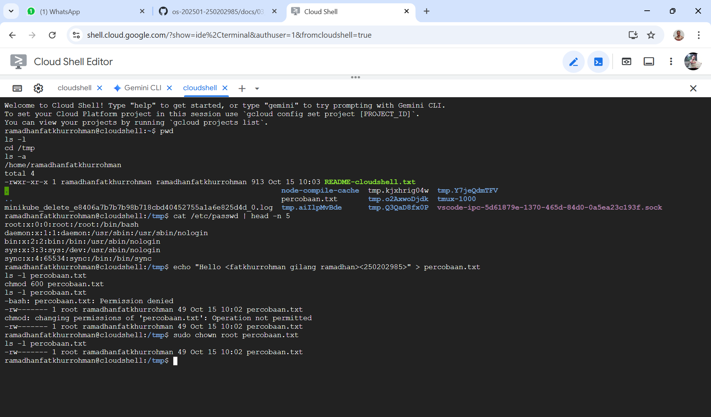

# Laporan Praktikum Minggu 3
Topik: Manajemen File dan Permission di Linux

---

## Identitas
- **Nama**  : Fatkhurrohman Gilang Ramadhan 
- **NIM**   : 250202985  
- **Kelas** : 1IKRB

---

## Tujuan
Setelah menyelesaikan tugas ini, mahasiswa mampu:
1. Menggunakan perintah `ls`, `pwd`, `cd`, `cat` untuk navigasi file dan direktori.
2. Menggunakan `chmod` dan `chown` untuk manajemen hak akses file.
3. Menjelaskan hasil output dari perintah Linux dasar.
4. Menyusun laporan praktikum dengan struktur yang benar.
5. Mengunggah dokumentasi hasil ke Git Repository tepat waktu.

---

## Dasar Teori
Pada praktikum minggu ini, mahasiswa akan mempelajari **pengelolaan file dan direktori menggunakan perintah dasar Linux**, serta konsep **permission dan ownership**.  
Praktikum berfokus pada:
- Navigasi sistem file dengan `ls`, `pwd`, `cd`, dan `cat`.
- Pengaturan hak akses file menggunakan `chmod`.
- Pengubahan kepemilikan file menggunakan `chown`.
- Dokumentasi hasil eksekusi dan pengelolaan repositori praktikum.

Tujuan utama dari praktikum ini adalah agar mahasiswa mampu **mengoperasikan perintah Linux dasar dengan benar**, memahami sistem izin (permission), dan mendokumentasikan hasilnya dalam format laporan Git.

---

---

## Langkah Praktikum
1. **Setup Environment**
   - Gunakan Linux (Ubuntu/WSL).
   - Pastikan folder kerja berada di dalam direktori repositori Git praktikum:
     ```
     praktikum/week3-linux-fs-permission/
     ```

2. **Eksperimen 1 – Navigasi Sistem File**
   Jalankan perintah berikut:
   ```bash
   pwd
   ls -l
   cd /tmp
   ls -a
   ```
   - Jelaskan hasil tiap perintah.
   - Catat direktori aktif, isi folder, dan file tersembunyi (jika ada).

3. **Eksperimen 2 – Membaca File**
   Jalankan perintah:
   ```bash
   cat /etc/passwd | head -n 5
   ```
   - Jelaskan isi file dan struktur barisnya (user, UID, GID, home, shell).

4. **Eksperimen 3 – Permission & Ownership**
   Buat file baru:
   ```bash
   echo "Hello <NAME><NIM>" > percobaan.txt
   ls -l percobaan.txt
   chmod 600 percobaan.txt
   ls -l percobaan.txt
   ```
   - Analisis perbedaan sebelum dan sesudah chmod.  
   - Ubah pemilik file (jika memiliki izin sudo):
   ```bash
   sudo chown root percobaan.txt
   ls -l percobaan.txt
   ```
   - Catat hasilnya.

5. **Eksperimen 4 – Dokumentasi**
   - Ambil screenshot hasil terminal dan simpan di:
     ```
     praktikum/week3-linux-fs-permission/screenshots/
     ```
   - Tambahkan analisis hasil pada `laporan.md`.

6. **Commit & Push**
   ```bash
   git add .
   git commit -m "Minggu 3 - Linux File System & Permission"
   git push origin main
   ```

---

## Kode / Perintah
Tuliskan potongan kode atau perintah utama:
```bash
pwd
ls -l
cd /tmp
ls -a
cat /etc/passwd | head -n 5
echo "Hello <NAME><NIM>" > percobaan.txt
ls -l percobaan.txt
chmod 600 percobaan.txt
ls -l percobaan.txt
sudo chown root percobaan.txt
ls -l percobaan.txt
```

---

## Hasil Eksekusi
Sertakan screenshot hasil percobaan atau diagram:


### Eksperimen 1 - Navigasi Sistem File
| Perintah | hasil | penjelasan |
|---------|-----------------------|-----------------------|
| `pwd` | `/home/ramadankhatkhurrohman` | Perintah `pwd` (print working directory) menampilkan jalur absolut (alamat lengkap) dari direktori kerja saat ini. Direktori aktif saat itu adalah direktori home pengguna yang sedang login. |
| `ls -lcd /tmp` | `drwxrwxrwt 4 root root 4096 Oct 15 10:02 /tmp` | Perintah ini menggunakan opsi `-d` untuk menampilkan detail direktori `/tmp` itu sendiri (bukan isinya) dalam format panjang (`-l`). `-c` memastikan ditampilkan waktu perubahan status (`ctime`). Isi: Ini menunjukkan /tmp adalah direktori (`d)`, dengan izin yang sangat terbuka (`rwxrwxrwt`), dimiliki oleh pengguna dan grup `root`, dan memiliki ukuran 4096 byte. |
| `ls -a` | Output menunjukkan banyak item, termasuk file-file seperti: `README-cloudshell.txt, minikube_delete..., percobaan.txt, tmp.XJBrig04v`, serta item yang diawali titik (.) seperti `.bashrc.` | Perintah `ls -a` (list all) menampilkan semua isi dari direktori kerja saat itu (`/home/ramadankhatkhurrohman`), termasuk file dan direktori tersembunyi (yang namanya diawali dengan titik). |

1. Direktori Aktif (Saat `pwd` dijalankan):

`/home/ramadankhatkhurrohman`

2. Isi Folder (Terlihat dari hasil `ls -a`):

File dan folder yang terlihat jelas (tidak tersembunyi) antara lain:

* `README-cloudshell.txt`
* `minikube_delete_e840b707b9b948718cbd40452755a1a6e82544d.log`
* `percobaan.txt`
* `tmp.killpMBde`
* `tmp.Y7JqMDeHV`
* `tmp.qzQxecDgk`
* `tmp.QdQA0hB0p`
* `tmux-1000`
* `vscode-ipc-5d61879e-1370-465d-84d0-0a5ea23c193f.sock`

3. File/Direktori Tersembunyi (Terlihat dari hasil `ls -a`):

File atau direktori yang namanya diawali dengan titik (`.`) seperti:

* `.bashrc`
* `.git`
* `.config`
* `.cache`

### Eksperimen 2 - Membaca File
**Struktur Baris File `/etc/passwd`**

Setiap baris memiliki struktur tetap, `user:password:UID:GID:gecos:home_dir:shell`, dengan rincian sebagai berikut:
| Posisi | Contoh Nilai | Nama Bidang | Keterangan Fungsi |
|---|------|-----------|------------------|
| 1 | `root` | User (nama pengguna) | Nama akun pengguna yang digunakan untuk login. |
| 2 | `x` | Password | Karakter x menunjukkan bahwa kata sandi sebenarnya disimpan terpisah di file /etc/shadow untuk alasan keamanan. |
| 3 | `0` | UID (User ID) | Nomor identifikasi unik untuk pengguna. UID 0 selalu dialokasikan untuk pengguna root (administrator). |
| 4 | `0` | GID (Group ID) | Nomor identifikasi grup utama pengguna. |
| 5 | `root` | GECOS (Komentar) | Bidang informasi opsional (misalnya, nama lengkap pengguna). |
| 6 | `/root` | Home Directory | Direktori default di mana pengguna akan ditempatkan saat login. |
| 7 | `/bin/bash` | Login Shell | Program shell yang akan dijalankan setelah login berhasil. `/usr/sbin/nologin` berarti akun tersebut tidak dapat digunakan untuk login interaktif (biasanya akun layanan sistem). |

**Isi File Lima Baris Pertama**

1. `root`: Akun administrator utama. Memiliki UID dan GID 0, home directory `/root`, dan shell interaktif `/bin/bash`.
2. `daemon`: Akun untuk menjalankan layanan sistem yang berjalan di background. Ia tidak dapat login karena shell-nya adalah `/usr/sbin/nologin`.
3. `bin`: Akun yang terkait dengan file biner sistem. Tidak dapat login interaktif.
4. `sys`: Akun yang terkait dengan file dan proses sistem. Tidak dapat login interaktif.
5. `sync`: Akun yang bertanggung jawab untuk memastikan data yang di-cache di memori ditulis ke disk. Tidak dapat login interaktif.

### Eksperimen 3 - Permission & Ownership
1. Analisis perbedaan sebelum dan sesudah `chmod`
   Perintah ini membandingkan hak akses file `percobaan.txt` saat baru dibuat dengan hak akses setelah diubah menjadi `600`.

* Sebelum `chmod 600`
   * Perintah: `ls -l percobaan.txt`

| Output Izin | Pemilik | Grup | Izin Teks | Penjelasan |
|---------|------|-----------|-------|--------|
| -rw-rw-r-- | `ramadankhatkhurrohman` | `ramadankhatkhurrohman` | 664 | Pemilik dan Grup dapat Membaca dan Menulis, sementara Lainnya hanya dapat Membaca. |

* Sesudah `chmod 600 percobaan.txt`
   * Perintah: `ls -l percobaan.txt`

| Output Izin | Pemilik | Grup | Izin Teks | Perubahan | 
|---------|------|-----------|-------|--------|
| `-rw-------` | `root` | `ramadankhatkhurrohman` | 600 | Kepemilikan file berhasil diubah dari `ramadankhatkhurrohman` menjadi `root`, sementara Grup dan Izin tetap. |

* Kesimpulan

**Perintah chmod 600 berhasil mengunci file tersebut. Perbedaannya adalah izin untuk Grup dan Lainnya diubah dari memiliki akses (`rw-rw-r--`) menjadi tidak memiliki akses sama sekali (`rw-------`). Ini adalah peningkatan keamanan karena file hanya bisa diakses oleh pemiliknya.**

1. Pencatatan Hasil Pengubahan Pemilik (`sudo chown`)
   Perintah ini bertujuan mengubah pemilik file dari pengguna Anda menjadi pengguna `root`.

   Perintah: `sudo chown root percobaan.txt` Hasil: (Tidak ada output kesalahan, menunjukkan perintah berhasil dijalankan karena Anda memiliki izin `sudo`).

   Hasil Akhir `ls -l percobaan.txt`

| Output Izin | Pemilik Baru | Grup | Izin Teks | Perubahan | 
|---------|------|-----------|-------|--------|
| `-rw-------` | `root` | `ramadankhatkhurrohman` | 600 | Kepemilikan file berhasil diubah dari `ramadankhatkhurrohman` menjadi `root`, sementara Grup dan Izin tetap. |

* Kesimpulan

**Setelah perintah `sudo chown root percobaan.txt `dijalankan, pengguna yang memiliki hak untuk Membaca dan Menulis file tersebut kini bukan lagi Anda, melainkan `root` (administrator sistem).**


---

## Analisis
- Jelaskan makna hasil percobaan.
   * `pwd` "print working directory" (cetak direktori kerja) berfungsi untuk menampilkan tempat dari direktori saat ini di mana Anda berada dalam sistem file.
   * `ls -lcd /tmp` berfungsi untuk menampilkan detail lengkap tentang direktori `/tmp` (bukan isinya), dengan fokus pada waktu perubahan status terakhirnya.
   * `ls -a` berfungsi untuk mendaftar semua file dan direktori dalam folder saat ini, termasuk file tersembunyi. File tersembunyi adalah file yang namanya diawali dengan titik (`.`), seperti `.bashrc` atau `.config`.
   * `cat /etc/passwd | head -n 5` berfungsi untuk menampilkan lima baris pertama dari file konfigurasi pengguna sistem, yaitu `/etc/passwd`.
   * `echo "Hello <NAME><NIM>" > percobaan.txt` berfungsi untuk membuat atau menimpa file bernama `percobaan.txt` dan mengisinya dengan baris teks `"Hello <NAME><NIM>"`.
   * `ls -l percobaan.txt` berfungsi untuk menampilkan detail file `percobaan.txt` segera setelah dibuat, menunjukkan izin (permissions) bawaan yang diberikan oleh sistem (default). 
   * `chmod 600 percobaan.txt` berfungsi untuk mengubah hak akses file `percobaan.txt` sehingga hanya pemilik file yang dapat membaca dan menulis isinya, sementara Grup dan Pengguna Lain sama sekali tidak memiliki akses.
   * `ls -l percobaan.txt` berfungsi untuk Menampilkan detail file `percobaan.txt` setelah hak aksesnya diubah. Output dari perintah ini akan menunjukkan bahwa permission file sekarang adalah `-rw-------`.
   * `sudo chown root percobaan.txt `berfungsi untuk mengubah pemilik file `percobaan.txt` dari pemiliknya yang sekarang menjadi pengguna `root`.
   * `ls -l percobaan.txt` berfungsi untuk memverifikasi perubahan kepemilikan. Setelah perintah pertama berhasil, output dari perintah ini akan menunjukkan bahwa kolom pemilik file `percobaan.txt` kini terdaftar sebagai `root`.
  
- Hubungkan hasil dengan teori (fungsi kernel, system call, arsitektur OS).  
   * Perintah shell seperti ls, chmod, dan chown adalah antarmuka di Ruang Pengguna (User Space) yang memerlukan System Call (Panggilan Sistem) untuk mengakses sumber daya. System Call ini adalah jembatan yang meminta layanan dari Kernel di Ruang Kernel (Kernel Space). Kernel, sebagai inti OS, mengelola dan menegakkan Manajemen File System (izin, kepemilikan), Manajemen I/O, dan Keamanan. Proses ini mencerminkan Arsitektur OS yang memisahkan Ruang Pengguna dan Kernel untuk melindungi sistem, di mana perintah sederhana pun pada dasarnya adalah permintaan layanan yang diatur oleh Kernel.
- Apa perbedaan hasil di lingkungan OS berbeda (Linux vs Windows)?  
   * Perbedaan utama hasil perintah shell antara Linux dan Windows terletak pada arsitektur sistem dan file system.

      * Di Linux, perintah seperti cat /etc/passwd | head -n 5 berhasil karena mengandalkan struktur sistem file tunggal (berakar pada /) dan file konfigurasi standar. Keamanan diatur oleh chmod dan chown menggunakan izin berbasis kode angka sederhana (permissions) yang dikelola langsung oleh Kernel.

     * Sebaliknya, Windows menggunakan struktur berbasis drive (C:\) dan tidak memiliki file sistem Linux yang serupa. Manajemen keamanan file di Windows menggunakan ACLs (Access Control Lists) yang jauh lebih kompleks, sehingga perintah Linux untuk izin (chmod dan chown) tidak tersedia secara bawaan dan harus diganti dengan alat seperti icacls. Secara keseluruhan, perbedaan mendasar di level sistem ini membuat perintah shell Linux tidak dapat berjalan langsung di Windows.


---

## Kesimpulan
Tuliskan 2–3 poin kesimpulan dari praktikum ini.

1. System Call Adalah Jembatan Kernel: Setiap perintah shell adalah aplikasi Ruang Pengguna yang harus memanggil System Call untuk meminta layanan dan mengakses sumber daya dari Kernel (inti OS).

2. Kernel Mengelola Keamanan & Izin: Perintah seperti chmod dan chown membuktikan bahwa Kernel adalah pihak yang secara ketat mengatur izin (permissions) dan kepemilikan file, menjamin keamanan dan integritas sistem.

3. Arsitektur OS Menentukan Perintah: Perbedaan fungsional antara Linux dan Windows menegaskan bahwa arsitektur OS (yaitu file system Linux vs. drive Windows) sangat menentukan perintah shell mana yang dapat berhasil dijalankan.
---

## Quiz
1. Apa fungsi dari perintah `chmod`?    
   **Jawaban:**

   **Fungsi dari perintahh `chmod` adalah untuk mengubah hak akses (permissions) pada file dan direktori di sistem operasi berbasis Unix/Linux. Perintah ini memungkinkanmu untuk menentukan siapa yang boleh Membaca (Read), Menulis (Write), dan Mengeksekusi (Execute) suatu file atau direktori.**  

2. Apa arti dari kode permission `rwxr-xr--`?    
   **Jawaban:**

   **`kode rwxr-xr--` setara dengan kode numerik 754, yang berarti:**

      * **Pemilik (User): Memiliki izin Penuh (`rwx`). Ia dapat Membaca, Menulis, dan Mengeksekusi file/direktori.**

      * **Grup (Group): Hanya dapat Membaca (`r`) dan Mengeksekusi (`x`), tetapi tidak dapat Menulis (`-`) atau mengubah isinya.**

      * **Lainnya (Others): Hanya dapat Membaca (`r`), tetapi tidak dapat Menulis (`-`) atau Mengeksekusi (`-`) file/direktori tersebut.**

3. Jelaskan perbedaan antara `chown` dan `chmod`.    
   **Jawaban:**  

   **Perbedaan mendasar antara `chown` dan `chmod` terletak pada target kontrolnya di sistem Linux/Unix. Perintah `chown` (CHange OWNer) bertugas mengubah kepemilikan file atau direktori, yaitu menentukan siapa—pengguna dan grup—yang memiliki kendali administratif atas item tersebut. Tindakan ini merupakan fungsi administratif yang krusial untuk keamanan dan oleh karena itu seringkali memerlukan hak akses super user (`sudo`). Sebaliknya, `chmod` (CHange MODe) bertugas mengubah hak akses (permissions), yang menentukan apa yang boleh dilakukan oleh Pemilik, Grup, dan Pengguna Lain (yaitu Membaca, Menulis, atau Mengeksekusi). Karena `chmod` hanya mengatur izin, tindakan ini dapat dilakukan oleh pemilik file itu sendiri dan biasanya menggunakan kode numerik.**


---

## Refleksi Diri
Tuliskan secara singkat:
- Apa bagian yang paling menantang minggu ini?
   * Memahami materi karena belum sempat dijelaskan oleh Dosen.
- Bagaimana cara Anda mengatasinya?  
   * Bertanya kepada teman, dan mencari di internet seputar materi minggu ini.

---

**Credit:**  
_Template laporan praktikum Sistem Operasi (SO-202501) – Universitas Putra Bangsa_
