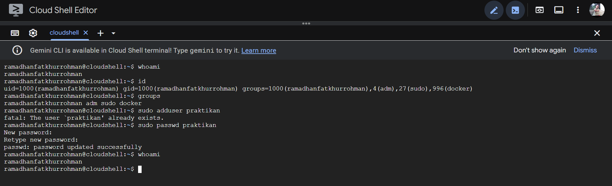

# Laporan Praktikum Minggu 4
Topik: Manajemen Proses dan User di Linux
---

## Identitas
- **Nama**  : Fatkhurrohman Gilang Ramadhan  
- **NIM**   : 250202985  
- **Kelas** : 1IKRB

---

## Tujuan
Setelah menyelesaikan tugas ini, mahasiswa mampu:
1. Menjelaskan konsep proses dan user dalam sistem operasi Linux.  
2. Menampilkan daftar proses yang sedang berjalan dan statusnya.  
3. Menggunakan perintah untuk membuat dan mengelola user.  
4. Menghentikan atau mengontrol proses tertentu menggunakan PID.  
5. Menjelaskan kaitan antara manajemen user dan keamanan sistem.  
---

## Dasar Teori
Pada praktikum minggu ini, mahasiswa akan mempelajari **konsep proses dan manajemen user dalam sistem operasi Linux.**  
Mahasiswa akan memahami bagaimana sistem operasi:
- Membuat dan mengatur proses (process management).  
- Mengelola user, group, serta hak akses pengguna.  
- Menampilkan, menghentikan, dan mengontrol proses yang sedang berjalan.  
- Menghubungkan konsep user management dengan keamanan sistem operasi.

Eksperimen dilakukan melalui penggunaan perintah dasar seperti `ps`, `top`, `kill`, `adduser`, `passwd`, `id`, dan `groups`.


---

## Langkah Praktikum
1. **Setup Environment**
   - Gunakan Linux (Ubuntu/WSL).  
   - Pastikan Anda sudah login sebagai user non-root.  
   - Siapkan folder kerja:
     ```
     praktikum/week4-proses-user/
     ```

2. **Eksperimen 1 – Identitas User**
   Jalankan perintah berikut:
   ```bash
   whoami
   id
   groups
   ```
   - Jelaskan setiap output dan fungsinya.  
   - Buat user baru (jika memiliki izin sudo):
     ```bash
     sudo adduser praktikan
     sudo passwd praktikan
     ```
   - Uji login ke user baru.

3. **Eksperimen 2 – Monitoring Proses**
   Jalankan:
   ```bash
   ps aux | head -10
   top -n 1
   ```
   - Jelaskan kolom penting seperti PID, USER, %CPU, %MEM, COMMAND.  
   - Simpan tangkapan layar `top` ke:
     ```
     praktikum/week4-proses-user/screenshots/top.png
     ```

4. **Eksperimen 3 – Kontrol Proses**
   - Jalankan program latar belakang:
     ```bash
     sleep 1000 &
     ps aux | grep sleep
     ```
   - Catat PID proses `sleep`.  
   - Hentikan proses:
     ```bash
     kill <PID>
     ```
   - Pastikan proses telah berhenti dengan `ps aux | grep sleep`.

5. **Eksperimen 4 – Analisis Hierarki Proses**
   Jalankan:
   ```bash
   pstree -p | head -20
   ```
   - Amati hierarki proses dan identifikasi proses induk (`init`/`systemd`).  
   - Catat hasilnya dalam laporan.

6. **Commit & Push**
   ```bash
   git add .
   git commit -m "Minggu 4 - Manajemen Proses & User"
   git push origin main
   ```

---

## Kode / Perintah
Tuliskan potongan kode atau perintah utama:
```bash
whoami
id
groups
sudo adduser praktikan
sudo passwd praktikan
ps aux | head -10
top -n 1
sleep 1000 &
ps aux | grep sleep
kill <PID>
pstree -p | head -20
```

---

## Hasil Eksekusi
Sertakan screenshot hasil percobaan atau diagram:

**Eksperimen 1**


**Eksperimen 2**
.png)
.png)

**Eksperimen 3**
.png)

**Eksperimen 4**
.png)


### Eksperimen 1
Jelaskan setiap output dan fungsinya.

| Perintah | Output Kunci | Fungsi Perintah | Makna Output | 
|---------|------|-----------|-------|
| `whoami` | `ramadhanfatkhurrohman` | Menampilkan nama user efektif yang sedang menjalankan shell. | Mengkonfirmasi identitas user saat ini. |
| `id` | `uid=1000(...) gid=1000(...) groups=...,27(sudo),996(docker)` | Menampilkan identitas UID (User ID), GID (Group ID), dan keanggotaan semua group pengguna. | Menunjukkan bahwa user memiliki UID dan GID 1000 dan yang terpenting, ia adalah anggota dari group `sudo` (memberi hak administratif) dan `docker` (memberi hak mengelola kontainer). |
| `groups` | `ramadhanfatkhurrohman adm sudo docker` | Mirip dengan `id`, tetapi hanya menampilkan nama group saja. | Mengkonfirmasi peran administratif user sebagai anggota `sudo`. |
| `sudo adduser praktikan` | `fatal: The user 'praktikan' already exists.` | Mencoba menambahkan user baru dengan hak administratif (`sudo`). | Perintah berhasil dijalankan dengan hak `sudo`, namun user `praktikan` sudah ada. Ini memvalidasi hak sudo `user` aktif. |
| `sudo passwd praktikan` | `password updated successfully` | Mencoba mengganti password user lain (`praktikan`) dengan hak `sudo`. | Berhasil. Ini adalah bukti nyata bahwa user aktif (`ramadhanfatkhurrohman`) memiliki hak istimewa (root) melalui `sudo` untuk memodifikasi informasi akun pengguna lain. |

### Eksperimen 2
Jelaskan kolom penting seperti PID, USER, %CPU, %MEM, COMMAND.

| Kolom | Fungsi dan Makna | Output Kunci | Makna Output | 
|---------|------|-----------|-------|
| PID | Process ID: Nomor identifikasi unik yang diberikan Kernel kepada setiap proses. Digunakan untuk menargetkan proses (misalnya dengan `kill`). | 1, 209, 6071 | PID 1 adalah proses shell induk utama (berfungsi sebagai init di lingkungan ini). 209 adalah daemon Docker. 6071 adalah proses `sleep` yang baru diluncurkan user. |
| USER | Pemilik Proses: Nama pengguna yang memiliki proses tersebut. Menentukan hak akses dan keamanan proses. | root, syslog, ramadha+ | `root` menjalankan layanan sistem penting (Docker, `sshd`). `syslog` adalah user sistem khusus. `ramadha+` (singkatan dari `ramadhanfatkhurrohman`) menjalankan shell dan proses user (seperti `sleep 1000`).|
| %CPU |  CPU Utilization: Persentase waktu CPU yang digunakan oleh proses selama interval terakhir. Indikator beban komputasi. | 0.0, 0.5, 0.9 | 0.0 mendominasi, menunjukkan sistem idle. 0.5 dan 0.9 adalah nilai tertinggi, berasal dari proses `containerd` dan `docker`, menunjukkan layanan tersebut memiliki aktivitas komputasi lebih tinggi dibandingkan proses lain. |
| %MEM | Memory Usage: Persentase memori fisik (RAM) yang digunakan oleh proses. Indikator penggunaan sumber daya memori. | 0.0, 0.3, 0.9 | 0.9 adalah nilai tertinggi, dimiliki oleh proses `docker` (PID 209). Ini wajar karena Docker daemon mengelola container dan membutuhkan alokasi memori yang signifikan. |
| COMMAND | Perintah: Perintah yang digunakan untuk memulai proses. | `/usr/bin/dockerd, sleep 1000, /bin/bash` | Mengidentifikasi fungsi proses: `dockerd` adalah layanan kontainer. `sleep 1000` adalah proses yang dijalankan user. `bash` adalah shell tempat user berinteraksi. |

### Eksperimen 3
Catat PID proses `sleep`.

PID proses `sleep 1000` adalah `6071`
Proses ini diidentifikasi pada baris yang memiliki `USER` `ramadha+` dan `COMMAND` `sleep 1000`.

### Eksperimen 4
Amati hierarki proses dan identifikasi proses induk (`init`/`systemd`).

| Rantai Proses | Hubungan Induk-Anak | Makna |
|---------|------|-----------|
| `bash(1)---docker(209)---containerd(243)` | `bash(1)` (Induk Utama) meluncurkan `docker(209)` (Docker Daemon), yang kemudian meluncurkan `containerd(243)` (Runtime Kontainer). | Menunjukkan bahwa infrastruktur kontainer adalah turunan langsung dari shell utama Anda. Kontainer dan proses daemon mereka diorganisir di bawah proses induk yang sama. |
| **` | ---python(25)---editor-proxy---runuser(475)---sh(476)---node(489)---bash(1888)`** | `python(25)` adalah bagian dari layanan back-end yang menjalankan editor-proxy, yang pada akhirnya meluncurkan sesi shell pengguna (`bash(1888)`). |

---

## Analisis
- Jelaskan makna hasil percobaan.
    
   * Hasil percobaan menunjukkan bahwa Manajemen User berfungsi dengan baik, di mana pengguna aktif memiliki hak administrator (`sudo`) yang memungkinkannya mengelola akun lain. Dari sisi Manajemen Proses, sistem beroperasi dengan beban sangat rendah (CPU 100% idle). Pengguna berhasil menjalankan proses di background (`sleep`), dan struktur hierarki proses (`pstree`) mengungkapkan kompleksitas lingkungan Cloud Shell yang melibatkan Docker dan layanan editor. Secara keseluruhan, sistem Linux ini menunjukkan pengelolaan sumber daya dan keamanan pengguna yang efektif dan terstruktur.

- Hubungkan hasil dengan teori (fungsi kernel, system call, arsitektur OS).

   * Kernel & System Call: Semua manajemen (proses dan user) diwujudkan melalui System Call. Kernel mengelola proses (PID, status) dan identitas user (UID, GID), serta memverifikasi izin `sudo`.

   * Arsitektur OS: Sistem menunjukkan isolasi User Space dan efisiensi Kernel (sistem 100% idle). Arsitektur multi-user dan berlapis terkonfirmasi, dengan Kernel menjaga hierarki proses yang kompleks (termasuk Docker dan layanan proxy) untuk memastikan keteraturan dan keamanan sumber daya.

- Apa perbedaan hasil di lingkungan OS berbeda (Linux vs Windows)?  

   * Percobaan di Linux berfokus pada transparansi Kernel (melalui `top` dan `ps`) dan otorisasi berbasis grup (`sudo`). Sementara itu, lingkungan Windows cenderung lebih mengandalkan antarmuka GUI (Task Manager) dan sistem izinnya lebih didasarkan pada SID dan policy yang berlapis.
---

## Kesimpulan

1. Manajemen User Memastikan Keamanan dan Otorisasi Berbasis Grup: Sistem Linux berhasil menerapkan prinsip multi-user dengan memverifikasi hak akses melalui User ID (UID) dan keanggotaan grup (`sudo`). Hal ini memungkinkan pengguna non-root untuk sementara mendapatkan hak administratif (terbukti saat berhasil mengubah password pengguna lain) sekaligus menjaga isolasi antara pengguna untuk integritas sistem.

2. Kernel Mengelola Proses Secara Efisien dan Hierarkis: Kernel Linux menunjukkan efisiensi tinggi dalam Manajemen Proses (terbukti dari CPU idle 100% pada kondisi standby). Pengawasan proses melalui `ps` dan `top` berfungsi efektif, dan debugging melalui `pstree` menunjukkan bahwa lingkungan operasional berjalan dalam struktur hierarki proses yang kompleks, menegaskan peran PID 1 sebagai induk yang mengorganisir semua layanan inti.

---

## Tugas & Quiz

### Tugas
1. Dokumentasikan hasil semua perintah dan jelaskan fungsi tiap perintah.

| Perintah | Fungsi | 
|---------|---------------------------------|
| `whoami` | Menampilkan nama pengguna (username) yang sedang aktif/digunakan saat ini. |
| `id` | Menampilkan identitas pengguna (user ID - UID), identitas grup utama (group ID - GID), dan identitas semua grup (groups) tempat pengguna menjadi anggotanya. |
| `groups` |Menampilkan semua grup tempat pengguna saat ini menjadi anggotanya. |
| `sudo adduser praktikan` | Membuat akun pengguna baru bernama `praktikan` pada sistem. Perintah ini memerlukan hak akses superuser (`sudo`). Setelahnya akan diminta beberapa informasi seperti kata sandi dan detail pengguna. |
| `sudo passwd praktikan` | Mengubah atau mengatur kata sandi untuk pengguna `praktikan`. Perintah ini juga memerlukan hak akses superuser (`sudo`). Sistem akan meminta Anda memasukkan kata sandi baru dua kali.|
| `ps aux  head -10` | Menampilkan daftar proses yang sedang berjalan pada sistem (`ps aux`) dan kemudian hanya menampilkan 10 baris pertama (`head -10`). Baris pertama adalah header kolom, diikuti 9 proses teratas. |
| `top -n 1` | Menampilkan penggunaan sumber daya sistem secara real-time (CPU, Memori, proses) dan kemudian keluar secara otomatis setelah 1 kali pembaruan (`-n 1`). Memberikan snapshot kondisi sistem saat ini. |
| `sleep 1000 &` | Menjalankan proses yang "tidur" (tidak melakukan apa-apa) selama 1000 detik di latar belakang (`&`). Proses ini akan segera kembali ke shell (perintah berikutnya dapat dijalankan). |
| `ps aux  grep sleep` | Mencari dan menampilkan baris-baris proses (`ps aux`) yang mengandung kata kunci `sleep`. Ini digunakan untuk menemukan proses `sleep 1000` yang baru saja dijalankan, termasuk proses `grep` itu sendiri. |
| ` kill <PID>` | Mengirim sinyal penghentian (default: TERM/15) ke proses dengan Process ID (PID) yang ditentukan. Biasanya digunakan untuk menghentikan proses yang berjalan di latar belakang, seperti proses `sleep 1000`. |
| `pstree -p  head -20` | Menampilkan hierarki (struktur pohon) dari semua proses yang sedang berjalan (`pstree`). Opsi `-p` menambahkan PID di samping nama proses. Hasilnya kemudian dibatasi hanya 20 baris teratas (`head -20`). |

2. Gambarkan hierarki proses dalam bentuk diagram pohon (pstree) di laporan.

```bash
ramadhanfatkhurrohman@cloudshell:~$ pstree -p | head -20
bash(1)-+-dockerd(209)-+-containerd(243)-+-{containerd}(251)
        |              |                 |-{containerd}(252)
        |              |                 |-{containerd}(253)
        |              |                 |-{containerd}(255)
        |              |                 |-{containerd}(259)
        |              |                 |-{containerd}(260)
        |              |                 `-{containerd}(1817)
        |              |-{dockerd}(215)
        |              |-{dockerd}(216)
        |              |-{dockerd}(217)
        |              |-{dockerd}(218)
        |              |-{dockerd}(232)
        |              |-{dockerd}(233)
        |              |-{dockerd}(263)
        |              |-{dockerd}(264)
        |              `-{dockerd}(275)
        |-logger(26)
        |-python(25)-+-editor-proxy(244)-+-runuser(475)---sh(476)---node(489)-+-node(1888)-+-bash(1899)
        |            |                   |                                    |            |-bash(2383)
        |            |                   |                                    |            |-bash(2867)
```

```

3. Jelaskan hubungan antara user management dan keamanan sistem Linux.

Manajemen User adalah fondasi dari Keamanan Sistem Linux. Dengan membagi pengguna menjadi root dan pengguna biasa, menerapkan prinsip hak akses minimal, dan memanfaatkan sistem group untuk otorisasi sementara (`sudo`), Linux memastikan bahwa sistem terlindungi dari kerusakan yang tidak disengaja oleh user dan membatasi dampak dari serangan siber yang berhasil menyusup ke akun pengguna biasa.

### Quiz
1. Apa fungsi dari proses `init` atau `systemd` dalam sistem Linux?
  
   **Jawaban:** 

   **Fungsi dari proses `init` atau `systemd` dalam sistem Linux adalah sebagai proses pertama dan induk dari semua proses lainnya di sistem. Proses ini memegang peran krusial dalam inisialisasi, manajemen, dan pemeliharaan sistem.**

2. Apa perbedaan antara `kill` dan `killall`?  

   **Jawaban:**

| Fitur | Perintah `kill` | Perintah `killall` |
|---------|------|-----------|
| Target proses | Menargetkan proses berdasarkan Process ID (PID) spesifik. | Menargetkan proses berdasarkan nama perintah (command name) atau nama executable-nya. |
| Sintaks dasar | `kill [SINYAL] <PID>` | `killall [SINYAL] <nama_proses>` |
| Penggunaan | Digunakan untuk menghentikan satu proses tertentu atau beberapa proses jika banyak PID dimasukkan. | Digunakan untuk menghentikan semua proses yang memiliki nama yang sama. |
| Contoh | `kill 6071` (Menghentikan hanya proses dengan PID 6071). | `killall firefox` (Menghentikan semua proses yang bernama `firefox`). |
| Risiko kesalahan | Rendah, karena PID adalah unik dan spesifik. | Lebih tinggi, jika ada banyak proses dengan nama yang sama yang dijalankan oleh user berbeda, semua akan terpengaruh. |

3. Mengapa user `root` memiliki hak istimewa di sistem Linux?  

   **Jawaban:**  

   **User root memiliki hak istimewa (hak tertinggi) di sistem Linux karena ia merupakan akun administrator utama yang dirancang untuk menjalankan semua fungsi Kernel dan mengontrol seluruh sistem, sebuah peran yang diwarisi dari sistem operasi Unix.**

---

## Refleksi Diri
Tuliskan secara singkat:
- Apa bagian yang paling menantang minggu ini?

   * Melakukan eksperimen karena sempat error. 

- Bagaimana cara Anda mengatasinya?  

   * Mencari tau letak errornya dimana, serta menjalankan  eksperimen menggunakan cloud shell karena tidak bisa mengoperasikan ubuntu atau wsl. 

---

**Credit:**  
_Template laporan praktikum Sistem Operasi (SO-202501) – Universitas Putra Bangsa_
