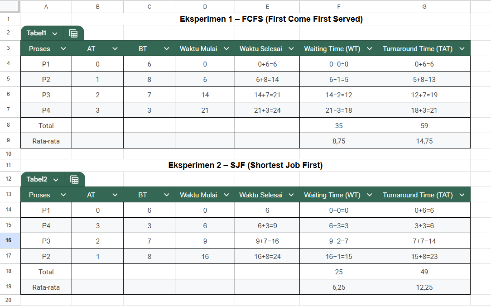

# Laporan Praktikum Minggu 5
Topik: Penjadwalan CPU – FCFS dan SJF  
---

## Identitas
- **Nama**  : Fatkhurrohman Gilang Ramadhan
- **NIM**   : 250202985
- **Kelas** : 1IKRB

---

## Tujuan
Setelah menyelesaikan tugas ini, mahasiswa mampu:
1. Menghitung *waiting time* dan *turnaround time* untuk algoritma FCFS dan SJF.  
2. Menyajikan hasil perhitungan dalam tabel yang rapi dan mudah dibaca.  
3. Membandingkan performa FCFS dan SJF berdasarkan hasil analisis.  
4. Menjelaskan kelebihan dan kekurangan masing-masing algoritma.  
5. Menyimpulkan kapan algoritma FCFS atau SJF lebih sesuai digunakan.  

---

## Dasar Teori
Pada praktikum minggu ini, mahasiswa akan mempelajari **algoritma penjadwalan CPU (CPU Scheduling)** menggunakan dua pendekatan dasar:  
- **FCFS (First Come First Served)**  
- **SJF (Shortest Job First)**  

Tujuan utamanya adalah memahami bagaimana sistem operasi menentukan urutan eksekusi proses, serta bagaimana *waiting time* dan *turnaround time* memengaruhi performa sistem.

Mahasiswa akan melakukan simulasi dan perbandingan hasil perhitungan kedua algoritma ini menggunakan **tabel observasi manual atau spreadsheet (Excel/Google Sheets)** tanpa perlu melakukan instalasi atau pemrograman tambahan.


---

## Langkah Praktikum
1. **Siapkan Data Proses**
   Gunakan tabel proses berikut sebagai contoh (boleh dimodifikasi dengan data baru):
   | Proses | Burst Time | Arrival Time |
   |:--:|:--:|:--:|
   | P1 | 6 | 0 |
   | P2 | 8 | 1 |
   | P3 | 7 | 2 |
   | P4 | 3 | 3 |

2. **Eksperimen 1 – FCFS (First Come First Served)**
   - Urutkan proses berdasarkan *Arrival Time*.  
   - Hitung nilai berikut untuk tiap proses:
     ```
     Waiting Time (WT) = waktu mulai eksekusi - Arrival Time
     Turnaround Time (TAT) = WT + Burst Time
     ```
   - Hitung rata-rata Waiting Time dan Turnaround Time.  
   - Buat Gantt Chart sederhana:  
     ```
     | P1 | P2 | P3 | P4 |
     0    6    14   21   24
     ```

3. **Eksperimen 2 – SJF (Shortest Job First)**
   - Urutkan proses berdasarkan *Burst Time* terpendek (dengan memperhatikan waktu kedatangan).  
   - Lakukan perhitungan WT dan TAT seperti langkah sebelumnya.  
   - Bandingkan hasil FCFS dan SJF pada tabel berikut:

     | Algoritma | Avg Waiting Time | Avg Turnaround Time | Kelebihan | Kekurangan |
     |------------|------------------|----------------------|------------|-------------|
     | FCFS | ... | ... | Sederhana dan mudah diterapkan | Tidak efisien untuk proses panjang |
     | SJF | ... | ... | Optimal untuk job pendek | Menyebabkan *starvation* pada job panjang |

4. **Eksperimen 3 – Visualisasi Spreadsheet (Opsional)**
   - Gunakan Excel/Google Sheets untuk membuat perhitungan otomatis:
     - Kolom: Arrival, Burst, Start, Waiting, Turnaround, Finish.
     - Gunakan formula dasar penjumlahan/subtraksi.
   - Screenshot hasil perhitungan dan simpan di:
     ```
     praktikum/week5-scheduling-fcfs-sjf/screenshots/
     ```

5. **Analisis**
   - Bandingkan hasil rata-rata WT dan TAT antara FCFS & SJF.  
   - Jelaskan kondisi kapan SJF lebih unggul dari FCFS dan sebaliknya.  
   - Tambahkan kesimpulan singkat di akhir laporan.

6. **Commit & Push**
   ```bash
   git add .
   git commit -m "Minggu 5 - CPU Scheduling FCFS & SJF"
   git push origin main
   ```

---

## Kode / Perintah
Tuliskan potongan kode atau perintah utama:
```bash
Waiting Time (WT) = waktu mulai eksekusi - Arrival Time
Turnaround Time (TAT) = WT + Burst Time

```

---

## Hasil Eksekusi
Sertakan screenshot hasil percobaan atau diagram:


---

## Eksperimen 1 – FCFS (First Come First Served)
Urutkan proses berdasarkan Arrival Time: P1 -> P2 -> P3 -> P4
* Tabel Perhitungan FCFS
   .png)

* Gantt Chart FCFS:
   ```bash
   | P1 | P2 | P3 | P4 |
   0    6    14   21   24
   ```
---
## Eksperimen 2 – SJF (Shortest Job First)
Urutkan proses berdasarkan Burst Time terpendek (dengan memperhatikan waktu kedatangan): P1 -> P4 -> P3 -> P2
* Tabel Perhitungan SJF
   .png)

* Gantt Chart SJF
```bash
| P1 | P4 | P3 | P2 |
0    6    9    16   24
```
## Perbandingan Hasil FCFS dan SJF
   | Algoritma | Avg Waiting Time | Avg Turnaround Time | Kelebihan | Kekurangan |
   |------------|------------------|----------------------|------------|-------------|
   | FCFS | 8,75 | 14,75 | Sederhana dan mudah diterapkan | Tidak efisien untuk proses panjang |
   | SJF | 6,25 | 12,25 | Optimal untuk job pendek | Menyebabkan *starvation* pada job panjang |
---

## Analisis
- Bandingkan hasil rata-rata WT dan TAT antara FCFS & SJF.  
   - Berdasarkan perhitungan di atas:

     - SJF menghasilkan rata-rata Waiting Time (6.25) dan rata-rata Turnaround Time (12.25) yang jauh lebih rendah dibandingkan dengan FCFS (8.75 dan 14.75).

      Hal ini menunjukkan bahwa SJF lebih efisien dalam memanfaatkan CPU dan meminimalkan waktu tunggu, karena SJF memprioritaskan proses dengan Burst Time terpendek, memungkinkan mereka selesai lebih cepat dan "membebaskan" sistem lebih cepat.

- Jelaskan kondisi kapan SJF lebih unggul dari FCFS dan sebaliknya. 
  - SJF lebih unggul dari FCFS
    - SJF akan selalu lebih unggul jika terdapat perbedaan signifikan pada Burst Time antar proses, terutama jika proses dengan BT pendek tiba sedikit lebih lambat daripada proses dengan BT sangat panjang (seperti P4 (BT=3) yang hanya menunggu P1 (BT=6) di FCFS, tetapi di SJF P4 dieksekusi segera setelah P1 selesai).
    - SJF secara teoritis optimal karena menghasilkan waktu tunggu rata-rata minimum untuk set proses tertentu.

  - FCFS lebih unggul (atau lebih praktis) dari SJF
    - FCFS unggul dalam hal kesederhanaan dan implementasi karena tidak memerlukan prediksi BT.
    - FCFS unggul dalam kondisi di mana semua proses memiliki BT yang hampir sama, karena dalam kasus ini, SJF tidak akan memberikan peningkatan kinerja yang signifikan, dan kompleksitas tambahan SJF tidak seimbang.
    - FCFS tidak menyebabkan starvation, menjamin bahwa setiap proses akan dieksekusi.

- kesimpulan. 
  - Algoritma SJF (Shortest Job First) memberikan kinerja yang lebih baik dibandingkan FCFS (First Come First Served) dalam hal meminimalkan rata-rata Waiting Time dan Turnaround Time. Namun, FCFS unggul dalam kesederhanaan dan keadilan (tidak ada risiko starvation). Dalam sistem yang memerlukan kinerja responsif dan efisiensi tinggi, SJF (khususnya versi preemptive-nya) adalah pilihan yang lebih baik, meskipun sulit untuk diimplementasikan secara sempurna di dunia nyata karena perlunya prediksi Burst Time.
---

## Kesimpulan
1. SJF Unggul dalam Kinerja: Algoritma SJF (Shortest Job First) terbukti lebih efisien karena menghasilkan rata-rata Waiting Time dan Turnaround Time yang lebih rendah. Ini terjadi karena SJF memprioritaskan proses dengan waktu eksekusi terpendek, sehingga mempercepat penyelesaian total seluruh job.

2. FCFS Kalah Efisien: FCFS (First Come First Served) mudah diimplementasikan, tetapi kurang efisien. Algoritma ini rentan terhadap "Efek Konvoi," di mana proses yang cepat terpaksa menunggu hingga proses yang lebih lambat yang datang lebih awal selesai, meningkatkan waktu tunggu rata-rata secara keseluruhan.

3. Keterbatasan Implementasi: Meskipun SJF optimal secara waktu, dalam praktiknya SJF memiliki kelemahan serius, yaitu sulit memprediksi Burst Time secara akurat dan memiliki risiko starvation, di mana proses yang sangat panjang bisa tertunda tanpa batas waktu.

---

## Quiz
1. Apa perbedaan utama antara FCFS dan SJF?  

   **Perbedaan utama antara FCFS (First Come First Served) dan SJF (Shortest Job First) terletak pada kriteria yang digunakan untuk memutuskan proses mana yang akan dieksekusi selanjutnya dan dampaknya terhadap efisiensi sistem.**  

2. Mengapa SJF dapat menghasilkan rata-rata waktu tunggu minimum? 

   **SJF menghasilkan rata-rata waktu tunggu minimum karena strateginya mengutamakan dan segera menyelesaikan proses dengan Burst Time (BT) terpendek, sehingga secara matematis meminimalkan total waktu tunda kumulatif yang ditambahkan ke sistem, karena penghematan waktu dari job pendek lebih besar daripada penambahan waktu tunggu pada job panjang.**  

3. Apa kelemahan SJF jika diterapkan pada sistem interaktif?
 
   **Kelemahan utama SJF pada sistem interaktif adalah ketidakmampuannya untuk memprediksi secara akurat Burst Time CPU berikutnya karena sifat input pengguna yang tidak terduga, sehingga SJF tidak dapat bekerja secara optimal. Selain itu, SJF berisiko tinggi menyebabkan starvation pada aplikasi atau tugas latar belakang yang membutuhkan waktu komputasi lama, yang pada akhirnya akan merusak responsivitas sistem dan membuat pengalaman pengguna menjadi buruk.**  

---

## Refleksi Diri
Tuliskan secara singkat:
- Apa bagian yang paling menantang minggu ini?  
- Bagaimana cara Anda mengatasinya?  

---

**Credit:**  
_Template laporan praktikum Sistem Operasi (SO-202501) – Universitas Putra Bangsa_
